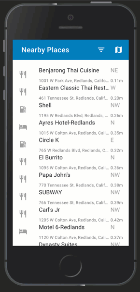

# Nearby Places JavaScript

This repo provides an example app called [Nearby Places](https://developers.arcgis.com/example-apps/nearby-javascript/?utm_source=github&utm_campaign=example_apps_nearby_javascript) that can be used as as starter for your organizations mapping applications built with [ArcGIS API 4 for JavaScript](https://developers.arcgis.com/javascript/). You can use the Nearby Places as is, or extend it using the ArcGIS API for JavaScript.

## Features
 * Geocoding with categories
 * Device location
 * Calculating bearing and distance
 * Automatic switch of basemap and renderer based on day or night
 * Built as a [Progressive Web App](https://developers.google.com/web/progressive-web-apps/)

This application takes advantage of numerous technologies for development purposes. It utlizes [webpack](https://webpack.js.org/) to compile and bundle the application code and other files. It is written in [TypeScript](http://www.typescriptlang.org/) and is built using [React](https://reactjs.org/), [React hooks](https://reactjs.org/docs/hooks-intro.html) and [custom React hooks](https://reactjs.org/docs/hooks-custom.html).

This application also uses [Workbox for Webpack](https://developers.google.com/web/tools/workbox/get-started/webpack) to set up [service workers](https://developer.mozilla.org/en-US/docs/Web/API/Service_Worker_API) for the application to cache application code and files, as well as uses an [appcache fallback](https://developer.mozilla.org/en-US/docs/Web/HTML/Using_the_application_cache) for Internet Explorer, Edge, and Safari.

[Intern](https://theintern.io/) is used for all unit tests.

Feel free to use this project as a starting point for your own applications!

## Usage

* Clone the repo and run `npm install`.

* _NOTE FOR WINDOWS USERS_ - You may need to install the [Windows-Build-Tools](https://github.com/felixrieseberg/windows-build-tools) to compile npm modules for this project. `npm install --global --production windows-build-tools`

* Login to [ArcGIS for Developers](https://developers.arcgis.com/) and [register](https://developers.arcgis.com/applications/#/) your app to create an Client ID.

* You will need to register your application with a Client ID so that you can take advantage of the premium [Directions and Routing](https://developers.arcgis.com/features/directions/) Services from the ArcGIS Platform. It is recommended that you create one application ID for development purposes and another application ID for production deployments.


* Once you have registered your application, copy the client id and create two files in the `env/` folder.
 - `env/development.env`
 - `env/production.env`

 In these files you can define the application ID for both environments for your application.

 ```
 # env/development.env
 ARCGIS_APP_ID=THISisMYdevelopmentID
 ```

  ```
 # env/production.env
 ARCGIS_APP_ID=THISisMYproductionID
 ```

 The application ID will be injected into your application during the webpack build process using the [dotenv-webpack](https://github.com/mrsteele/dotenv-webpack#readme) plugin. Although you can whitelist your application ID to various domains, it still a good practice to not check these `.env` files into your git repo. The application git repo is already set up to ignore these files.

* You will also want to provide the Portal URL for your Organization, such as `"https://<MY-ORGANIZATION>.maps.arcgis.com"` in the `src/config.ts` file.

```js
// src/config.ts
export const appId = process.env.ARCGIS_APP_ID;

/**
 * Users Portal URL.
 */
export const portalUrl = "https://www.arcgis.com"; // default Portal URL
```

* As part of the registration process, add a redirect uri for your app.  Navigate to the Redirect URIs section at the bottom of the registration page and set the redirect uri as shown for development purposes. You will also want to add a redirect uri for where your application will be deployed.  This redirect uri is the default redirect for `https://www.arcgis.com`.

For development purposes, you will want to add the following redirects to your Application ID:

* `http://127.0.0.1:8080`

When you deploy your application, do not use the same Application ID for development as production. You want your Application ID to _only redirect to your production website_.


* `npm test` - run unit tests with local chrome driver.
* `npm start` - compile application and run it in a local server at `http://localhost:8080/`.
* `npm run build` - compile application for deployment.
* `npm run serve` - Run a production build of the application, but serve it up locally to see how the built app will behave.

Use `npm run serve` to full test that Service Workers are working correctly with `webpack-dev-server` self signed certificates. Refer to [this article](https://deanhume.com/testing-service-workers-locally-with-self-signed-certificates/) on how to run Chrome with proper flags enabled for development purposes.

## Demo

* [Live demo](https://arcgis-nearby-js.netlify.com/)



## Issues
Find a bug or want to request a new feature enhancement?  Let us know by submitting an issue.

## Contributing
Anyone and everyone is welcome to [contribute](CONTRIBUTING.md). We do accept pull requests.

1. Get involved
2. Report issues
3. Contribute code
4. Improve documentation

## Licensing
Copyright 2018 Esri

Licensed under the Apache License, Version 2.0 (the "License"); you may not use this file except in compliance with the License. You may obtain a copy of the License at

http://www.apache.org/licenses/LICENSE-2.0

Unless required by applicable law or agreed to in writing, software distributed under the License is distributed on an "AS IS" BASIS, WITHOUT WARRANTIES OR CONDITIONS OF ANY KIND, either express or implied. See the License for the specific language governing permissions and limitations under the License.

A copy of the license is available in the repository's [LICENSE](./LICENSE) file
